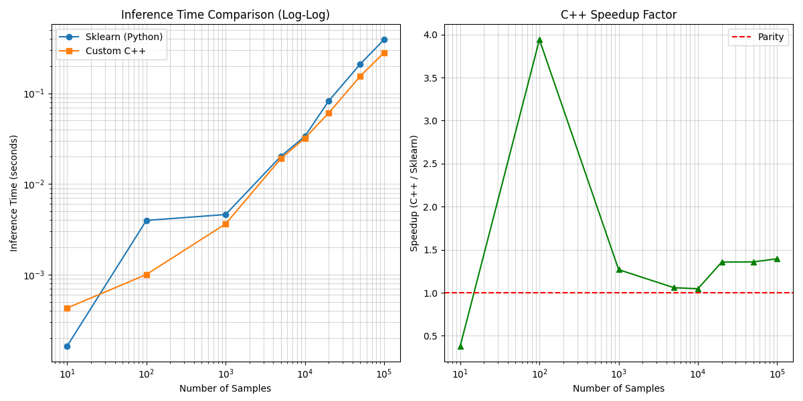

# Simple Neural Network in C++

This is a simple implementation of a Neural Network (Multi-Layer Perceptron) in C++ from scratch, including a custom Matrix library.

## Features

- **Matrix Library**: Custom implementation of matrix operations (multiplication, addition, transposition, etc.).
- **Neural Network**: 
  - Configurable number of input, hidden, and output nodes.
  - Sigmoid activation function.
  - Backpropagation training algorithm (Stochastic Gradient Descent).
- **Example**: Solves the XOR problem in `main.cpp`.

## Performance

This implementation has been optimized to outperform Scikit-learn's `MLPClassifier` for inference on larger batches.

**Benchmark Results (Inference Speedup vs Sklearn):**



## File Structure

- `src/Matrix.h` & `src/Matrix.cpp`: Optimized Matrix library (Flat memory, Multi-threaded).
- `src/NeuralNetwork.h` & `src/NeuralNetwork.cpp`: Neural Network class.
- `src/main.cpp`: Main entry point with XOR example.
- `src/benchmark.cpp`: C++ benchmarking tool.
- `benchmark.py`: Unified Python benchmarking tool (Comparison, Plotting).
- `SklearnNeuralNetwork.py`: Python wrapper for Scikit-learn model.

## How to Build and Run

1. **Compile the C++ Benchmark**:
   ```bash
   g++ src/benchmark.cpp src/NeuralNetwork.cpp src/Matrix.cpp -o benchmark_cpp -std=c++11 -O3 -ffast-math
   ```

2. **Run the Comparison**:
   ```bash
   python3 benchmark.py
   ```
   This will generate `benchmark_results.png`.

## Advanced Benchmarking

### 1. Comparison Plotting
To generate a visual comparison of C++ vs Sklearn performance:

1. Install dependencies:
   ```bash
   pip install matplotlib numpy scikit-learn
   ```
2. Run the plotting script:
   ```bash
   python3 benchmark_comparison_plot.py
   ```
   This will generate `benchmark_results.png`.

### 2. Ray Distributed Inference
To test distributed inference using Ray (Python):

1. Install Ray:
   ```bash
   pip install ray psutil
   ```
2. Run the Ray benchmark:
   ```bash
   python3 benchmark_ray.py
   ```
